# Cadence

A model-agnostic multi-agent framework with structured planning, tiered memory, and parallel task execution.

Cadence enables autonomous agents to break down complex tasks into dependency graphs, delegate work to specialist agents, and coordinate results — all while maintaining persistent memory and reasoning traces.

## Architecture

```mermaid
graph TB
    subgraph Clients
        CLI[CLI REPL]
        WebUI[React Web UI]
    end

    subgraph Orchestration
        Orch[Orchestrator]
        DAG[Task DAG]
    end

    subgraph Agents
        A1[Researcher]
        A2[Coder]
        A3[Reviewer]
        A4[General]
    end

    subgraph Core Services
        LLM[LLM Interface]
        Memory[Memory — ChromaDB]
        KB[Knowledge Base]
        Tools[Tool Registry]
        Bus[Message Bus]
    end

    subgraph LLM Providers
        Claude[Claude]
        GPT[GPT-4]
        Bedrock[AWS Bedrock]
    end

    CLI & WebUI --> Orch
    Orch --> DAG
    DAG --> A1 & A2 & A3 & A4
    A1 & A2 & A3 & A4 --> LLM & Memory & Tools & Bus
    LLM --> Claude & GPT & Bedrock
```



**Request lifecycle:** User message → Orchestrator plans a task DAG → Agents execute tasks in parallel (think → act → observe loops) → Results are synthesized → Response is evaluated and returned.

## Features

- **Multi-Agent Orchestration** — Task DAG with dependency resolution, specialist roles, and parallel execution
- **Smart Model Routing** — Two-tier fast/strong strategy with automatic task classification and fallback chains
- **Tiered Memory** — ChromaDB-backed vector store with time-decay scoring and namespace isolation
- **Knowledge Base** — Ingest and search PDFs, DOCX, emails, and web pages with semantic search
- **Knowledge Graph** — NetworkX-backed entity-relationship modeling with path finding and subgraph extraction
- **Cross-Session Learning** — Strategy tracking with success rate analytics and confidence-scored recommendations
- **Agent Message Bus** — Async pub/sub communication with topic routing and request-reply patterns
- **Streaming** — SSE token streaming with real-time tool execution events and reasoning traces
- **Human-in-the-Loop** — Checkpoint-based approval workflows that pause execution for human review
- **Multi-Modal Input** — Vision support for images across Claude, GPT-4, and Gemini
- **Self-Modifying Prompts** — LLM-driven prompt evolution with reflection, version history, and rollback
- **Skill System** — Declarative SKILL.md format with versioning and auto-discovery
- **30+ Built-in Tools** — File ops, sandboxed code execution, web fetching, browser automation (Playwright), memory, knowledge base/graph, git, and more
- **Web UI** — React frontend with multi-chat sidebar, config panel, tool/skill browsers, and live reasoning trace

## Tech Stack

| Layer | Technology |
|-------|------------|
| Core | Python 3.11+, Anthropic SDK, OpenAI SDK, Pydantic 2.0+ |
| API | FastAPI, Uvicorn, WebSocket, SSE |
| Memory & Knowledge | ChromaDB, NetworkX, PyPDF, python-docx |
| Storage & Learning | SQLite (WAL mode) |
| Frontend | React 19, TypeScript, Vite |
| Testing | pytest, pytest-asyncio, Ruff |

## Quick Start

### Prerequisites

- Python 3.11+
- Node.js 22+ (for frontend)

### Installation

```bash
# Install Python package in dev mode
pip install -e ".[dev]"

# Optional: browser automation support
pip install -e ".[dev,browser]" && playwright install chromium

# Install frontend
cd frontend && npm ci && cd ..

# Set your API key
export ANTHROPIC_API_KEY="your-key-here"
```

### Usage

```bash
# CLI
cadence

# API server (REST + WebSocket + React UI at http://localhost:8000)
cadence-server
```

CLI commands: `/skills`, `/trace`, `/config`, `/quit`

## Project Structure

```
cadence/
├── agents/       # Orchestration and task DAG execution
├── core/         # Agent loop, config, LLM, message bus, streaming, checkpoints
├── knowledge/    # Document ingestion, parsing, knowledge graph
├── learning/     # Cross-session strategy tracking
├── memory/       # ChromaDB-backed tiered memory
├── prompts/      # Self-modifying prompt evolution
├── routing/      # Smart model routing with fallback chains
├── skills/       # SKILL.md parser
├── storage/      # SQLite chat persistence
├── tools/        # 30+ built-in tools
├── api.py        # FastAPI endpoints
├── cli.py        # Interactive REPL
└── server.py     # Server entry point
frontend/         # React + TypeScript web UI
config/           # default.yaml configuration
tests/            # Unit and integration tests
```

## Configuration

Config lives in `config/default.yaml` and can be overridden with environment variables:

```bash
CADENCE_MODELS_STRONG=gpt-4o
CADENCE_AGENTS_MAX_DEPTH=3
CADENCE_MEMORY_DECAY_RATE=0.1
```

Key settings:

| Setting | Default | Description |
|---------|---------|-------------|
| `models.strong` | claude-sonnet-4-5-20250514 | Complex reasoning and code |
| `models.fast` | claude-haiku-4-5-20251001 | Planning and simple tasks |
| `agents.max_parallel` | 4 | Max concurrent agents |
| `budget.max_tokens_per_task` | 100000 | Per-task token ceiling |
| `memory.decay_rate` | 0.05 | Relevance decay per day |

## Testing

```bash
pytest tests/ -v
```

## License

See [LICENSE](LICENSE) for details.
