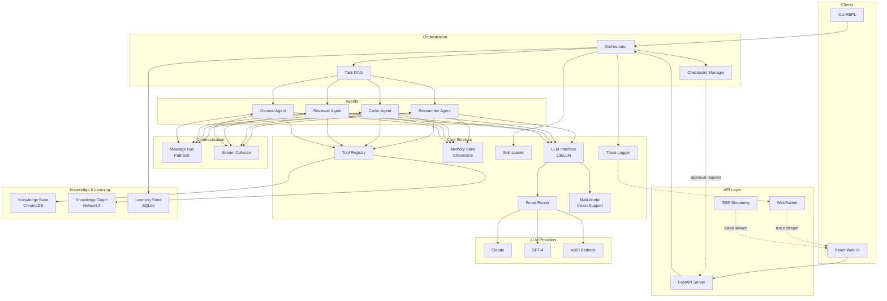
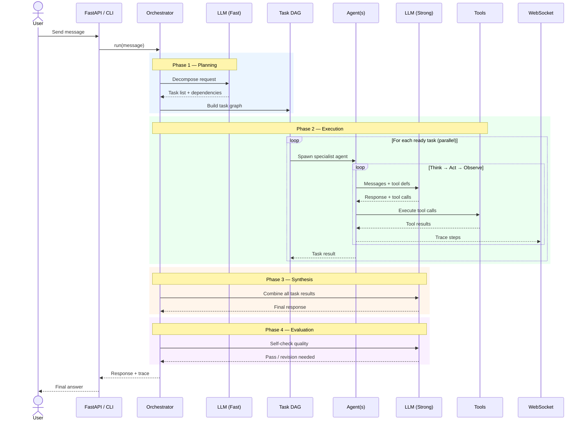
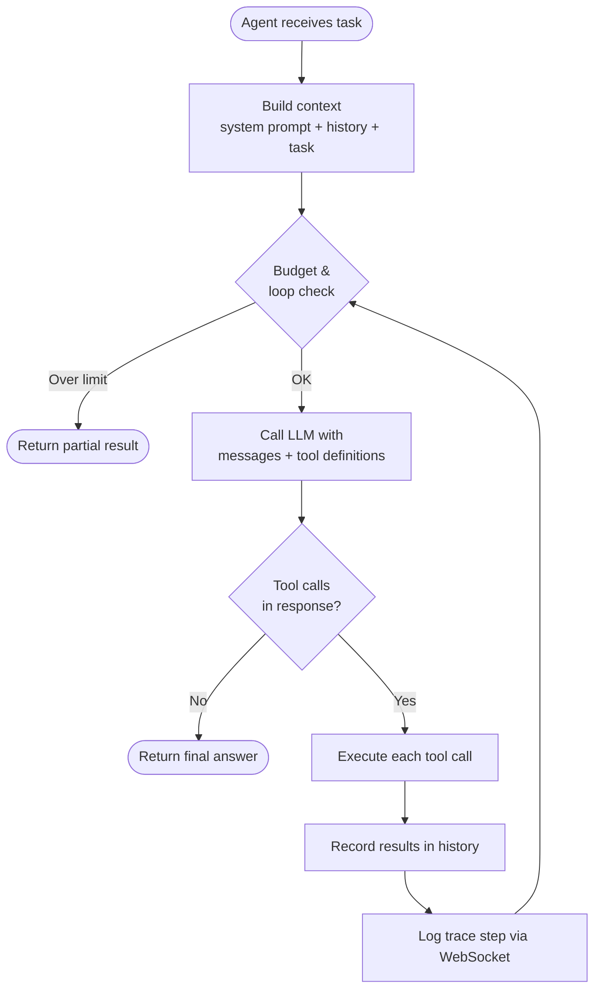
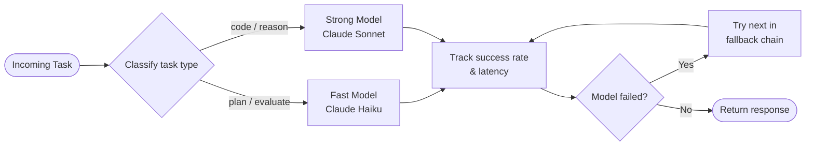
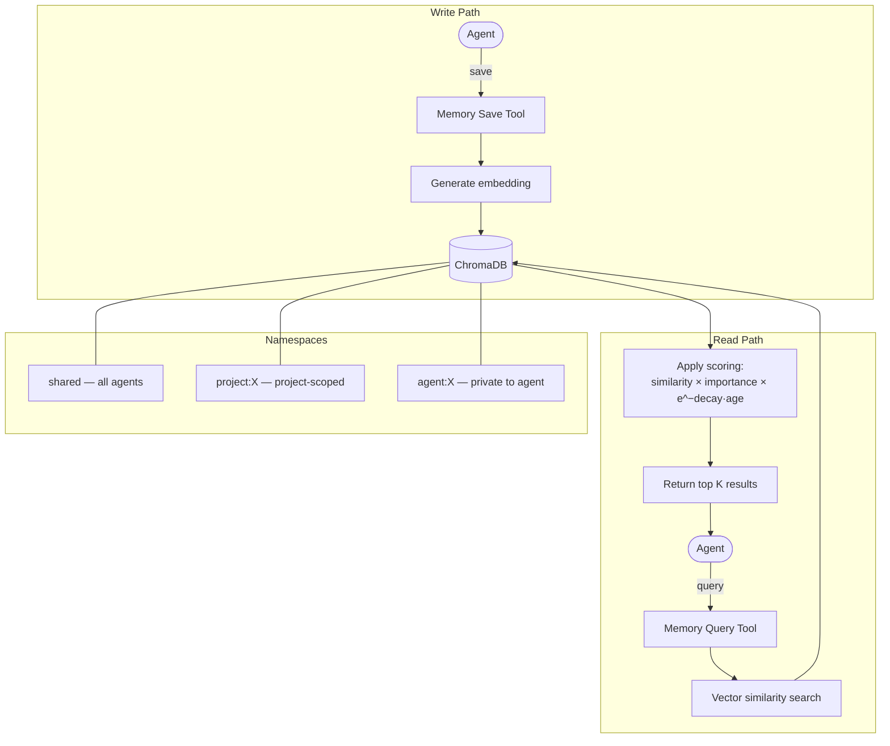
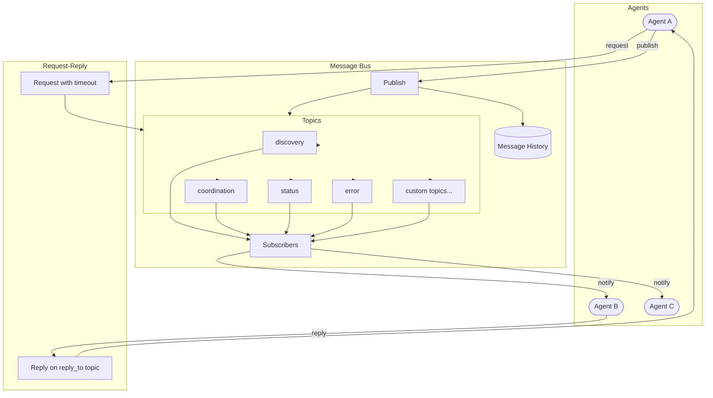
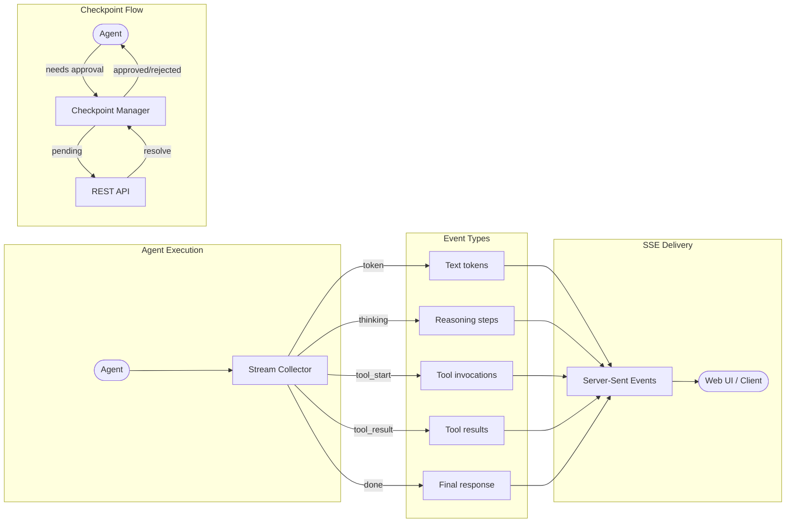
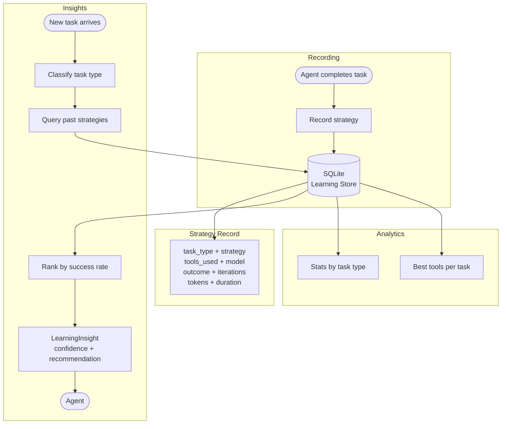
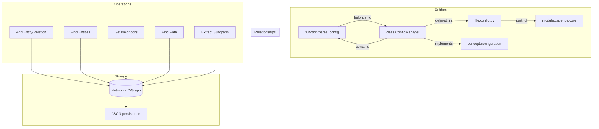
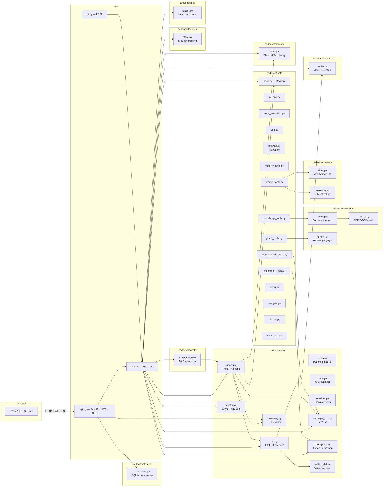

# Cadence

A model-agnostic multi-agent framework with structured planning, tiered memory, and parallel task execution.

Cadence enables autonomous agents to break down complex tasks into dependency graphs, delegate work to specialist agents, and coordinate results — all while maintaining persistent memory and reasoning traces.

## Architecture

### High-Level Overview



### Request Lifecycle



### Agent Think → Act → Observe Loop



### Smart Model Routing



### Memory System



### Agent Message Bus



### Streaming & Checkpoints



### Cross-Session Learning



### Knowledge Graph



### System Component Map



## Features

- **Multi-Agent Orchestration** — Task DAG with dependency resolution, specialist agent roles (researcher, coder, reviewer), parallel execution, and loop detection
- **Smart Model Routing** — Two-tier model strategy (fast/strong), automatic task classification, fallback chains, and per-model success tracking
- **Agent Message Bus** — Async pub/sub inter-agent communication with topic-based routing, priority levels (low/normal/high/urgent), request-reply patterns with timeouts, and message history
- **Streaming Responses** — Server-Sent Events (SSE) streaming with real-time token delivery, tool execution events, reasoning steps, and status updates via async event queues
- **Human-in-the-Loop Checkpoints** — Approval workflows that pause agent execution for human review, with checkpoint types (approval, clarification, confirmation), configurable timeouts, and REST API resolution
- **Tiered Memory** — ChromaDB-backed vector store with time-decay relevance scoring, importance weighting, and namespace isolation
- **Knowledge Base Ingestion** — Ingest and search across PDFs, DOCX, emails (.eml), web pages, and plain text with automatic chunking and semantic search
- **Knowledge Graph** — NetworkX-backed directed graph for structured entity-relationship modeling, with path finding, subgraph extraction, neighbor traversal, and JSON persistence
- **Cross-Session Learning** — SQLite-backed strategy tracking across sessions with task classification, success rate analytics, tool effectiveness ranking, and confidence-scored recommendations
- **Multi-Modal Input** — Vision support for images (PNG, JPEG, GIF, WebP) from files, base64, or URLs, with automatic vision model detection across Claude, GPT-4, and Gemini
- **Self-Modifying Prompts** — LLM-driven prompt evolution with reflection after tasks, performance-based modifications, version history, and rollback
- **Skill System** — Declarative SKILL.md format with versioning, dependency resolution, and auto-discovery
- **Built-in Tools** — 30+ tools for file operations, code execution (sandboxed), web fetching, memory, browser automation, knowledge base/graph, prompt management, learning insights, message bus, and agent delegation
- **Browser Automation** — Playwright-powered headless browsing with navigation, clicking, form filling, screenshots, and structured data extraction
- **Security & Sandboxing** — Permission tiers (read-only, standard, privileged, unrestricted), execution timeouts, resource limits, path allowlists, and blocked command lists
- **Persistent Chat Storage** — SQLite-backed chat and session history that survives server restarts, with automatic localStorage migration and offline fallback
- **Conversation Context Management** — Configurable history window with automatic LLM-based compression of older turns
- **Reasoning Traces** — Step-by-step JSONL logging with WebSocket streaming to the frontend
- **Web UI** — React frontend with multi-chat sidebar, tabbed config panel (token budget, agents, memory), tool/skill browsers, and live reasoning trace

## Tech Stack

| Layer | Technology |
|-------|------------|
| Core | Python 3.11+, LiteLLM, Pydantic 2.0+ |
| API | FastAPI, Uvicorn, WebSocket, Server-Sent Events |
| Memory | ChromaDB |
| Knowledge | ChromaDB, NetworkX, PyPDF, python-docx, BeautifulSoup4 |
| Learning | SQLite (WAL mode) |
| Storage | SQLite (WAL mode) |
| Browser | Playwright (optional) |
| Cloud | AWS Bedrock via boto3 (optional) |
| Frontend | React 19, TypeScript, Vite |
| Testing | pytest, pytest-asyncio, Ruff |
| Deployment | pip, npm |

## Quick Start

### Prerequisites

- Python 3.11+
- Node.js 22+ (for frontend)

### Installation

```bash
# Install Python package in dev mode
pip install -e ".[dev]"

# Install with browser automation support (optional)
pip install -e ".[dev,browser]"
playwright install chromium

# Install frontend dependencies
cd frontend && npm ci && cd ..

# Set your API key
export ANTHROPIC_API_KEY="your-key-here"
```

### Run the CLI

```bash
cadence
```

Commands: `/skills`, `/trace`, `/config`, `/quit`

### Run the API Server

```bash
cadence-server
```

This serves the REST API at `http://localhost:8000/api`, WebSocket at `ws://localhost:8000/ws`, and the React frontend at `http://localhost:8000`.

## Project Structure

```
cadence/
├── agents/          # Multi-agent orchestration and task DAG execution
├── core/            # Agent loop, config, LLM, keystore, message bus, streaming, checkpoints, multi-modal
├── knowledge/       # Knowledge base ingestion, document parsing, knowledge graph, and semantic search
├── learning/        # Cross-session strategy tracking and analytics
├── memory/          # ChromaDB-backed tiered memory with time decay
├── prompts/         # Self-modifying prompt evolution and version tracking
├── routing/         # Smart model routing with fallback chains
├── skills/          # SKILL.md parser with dependency resolution
├── storage/         # SQLite-backed persistent chat and session storage
├── tools/           # 30+ built-in tools (see Tools section below)
├── api.py           # FastAPI REST + WebSocket + SSE endpoints
├── cli.py           # Interactive REPL
└── server.py        # API server entry point
config/
└── default.yaml     # Default configuration
data/                # Runtime data (SQLite DB, traces, memory vectors, knowledge graph)
frontend/            # React + TypeScript web UI
skills/              # Example skill definitions
tests/               # Unit and integration tests
```

## Configuration

Configuration lives in `config/default.yaml` and can be overridden with environment variables:

```bash
CADENCE_MODELS_STRONG=gpt-4o
CADENCE_AGENTS_MAX_DEPTH=3
CADENCE_MEMORY_DECAY_RATE=0.1
```

Key settings:

| Setting | Default | Description |
|---------|---------|-------------|
| `models.strong` | claude-sonnet-4-5-20250514 | Model for complex reasoning and code |
| `models.fast` | claude-haiku-4-5-20251001 | Model for planning and simple tasks |
| `models.embedding` | text-embedding-3-small | Model for memory and KB embeddings |
| `agents.max_parallel` | 4 | Max concurrent agents |
| `agents.max_iterations_per_task` | 25 | Circuit breaker per task |
| `budget.max_tokens_per_task` | 100000 | Per-task token ceiling |
| `budget.max_tokens_per_session` | 500000 | Per-session token ceiling |
| `memory.decay_rate` | 0.05 | Relevance decay per day |
| `conversation.max_history_turns` | 50 | Max user+assistant pairs to retain |
| `conversation.compression_enabled` | true | Summarize older context automatically |
| `prompt_evolution.enabled` | true | Enable self-modifying prompt system |
| `execution.timeout_seconds` | 120 | Per-execution timeout |

## Built-in Tools

| Tool | Permission | Description |
|------|-----------|-------------|
| ReadFile, WriteFile, ListFiles, SearchFiles | STANDARD | File operations with path safety checks |
| CodeExecution | PRIVILEGED | Sandboxed code/shell execution with resource limits |
| WebFetch | STANDARD | HTTP requests and web page fetching |
| BrowseWeb, BrowserClick, BrowserForm, BrowserScreenshot, BrowserExtract | PRIVILEGED | Playwright-powered headless browser automation |
| MemorySave, MemoryQuery, MemoryDelete | STANDARD | Tiered memory with namespace isolation |
| KBIngest, KBSearch, KBList, KBDelete | STANDARD | Knowledge base document ingestion and search |
| GraphAddEntity, GraphAddRelation, GraphQuery | STANDARD | Knowledge graph entity and relationship management |
| PromptView, PromptModify, PromptHistory, PromptRollback | STANDARD | Self-modifying prompt management |
| BusPublish, BusPeek | STANDARD | Inter-agent message bus communication |
| RequestApproval | STANDARD | Human-in-the-loop checkpoint requests |
| LearningInsights, LearningStats | READ_ONLY | Cross-session strategy analytics and recommendations |
| Screenshot, ImageDescribe | STANDARD | Screen capture and image analysis for multi-modal input |
| Delegate | STANDARD | Spawn sub-agents for parallel task execution |
| GitOps | PRIVILEGED | Git operations (status, diff, commit, branch) |
| Database | PRIVILEGED | Database queries and schema inspection |
| HTTPClient | STANDARD | Structured HTTP API calls |

## API Endpoints

| Method | Path | Description |
|--------|------|-------------|
| POST | `/chat` | Send a message |
| POST | `/api/chat/stream` | Send a message with SSE streaming response |
| GET | `/chats` | List all persisted chats |
| GET | `/chats/{id}` | Get a chat with all messages |
| POST | `/chats` | Create a new chat |
| PUT | `/chats/{id}` | Update chat metadata |
| DELETE | `/chats/{id}` | Delete a chat and its messages |
| POST | `/chats/{id}/messages` | Add a message to a chat |
| GET | `/config` | Get current configuration |
| PUT | `/config` | Update configuration |
| GET | `/tools` | List available tools |
| GET | `/skills` | List loaded skills |
| GET | `/health` | Health check |
| WS | `/ws` | Live reasoning trace stream |
| GET | `/keys` | List stored API key providers |
| POST | `/keys` | Store an API key |
| DELETE | `/keys/{provider}` | Remove a stored key |
| POST | `/api/kb/ingest` | Ingest a document from path, URL, or text |
| POST | `/api/kb/ingest/upload` | Ingest an uploaded file |
| POST | `/api/kb/search` | Semantic search across knowledge base |
| GET | `/api/kb/documents` | List all ingested documents |
| DELETE | `/api/kb/documents/{id}` | Delete a document |
| GET | `/api/kb/stats` | Knowledge base statistics |
| POST | `/api/graph/entities` | Create a knowledge graph entity |
| GET | `/api/graph/entities` | Search entities by name or type |
| POST | `/api/graph/relationships` | Create a relationship between entities |
| GET | `/api/graph/neighbors/{id}` | Get neighboring entities |
| GET | `/api/graph/stats` | Knowledge graph statistics |
| DELETE | `/api/graph/entities/{id}` | Delete an entity and its edges |
| GET | `/api/bus/topics` | List message bus topics and stats |
| GET | `/api/bus/messages/{topic}` | Read recent messages on a topic |
| GET | `/api/checkpoints` | List checkpoints (filter by status) |
| POST | `/api/checkpoints/{id}/resolve` | Approve or reject a checkpoint |
| GET | `/api/learning/stats` | Aggregate learning statistics |
| GET | `/api/learning/insights/{type}` | Get strategy recommendations for task type |
| GET | `/api/files/download` | Download a project file |
| GET | `/api/files/reveal` | Open file location in system file manager |

## Testing

```bash
pytest tests/ -v
```

## License

See [LICENSE](LICENSE) for details.
